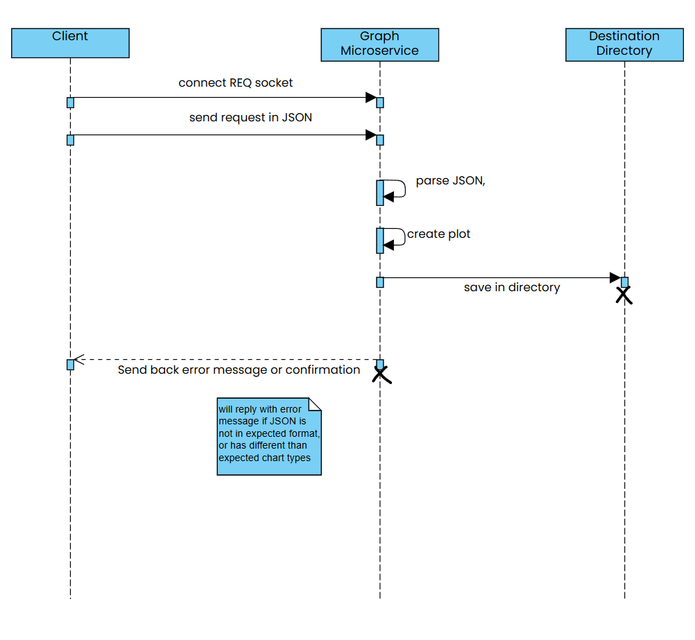

# Data Visualizer Microservice
This microservice received a JSON and plots the data via matplotlib. This document will detail:  
1. How to format JSON in the request
2. How to set up program to send request
3. Receiving the reply after plot created

# Communication Contract
This microservice uses the zeromq REQ/REP pattern for sending and receiving data. After starting the zmq-server.py file, it will listen for requests until the process is killed.  

Example for setting up, example is on port 5555 but this may be changed.
```python
context = zmq.Context()
socket = context.socket(zmq.REP)
socket.bind("tcp://*:5555")
```
## How to Request Data from Microservice
### Example JSON request:
```json
{
    "chart_type": "bar",
    "data": {
        "headers": ["mimetype","count"],
        "rows": [
            ["text/plain", 3],
            ["application/pdf", 7], 
            ["image", 4]
        ]
    }
}
```
1. chart_type : Can be "bar", "pie", or "graph". Indicates type of plot to generate.
2. data : Must have headers and rows. The headers list must have 2 elements and the lists within rows must have two elements. 
### How to Send Request
Here is an example on how a request is sent.
```python
import zmq
import json


context = zmq.Context()

socket = context.socket(zmq.REQ)
socket.connect("tcp://localhost:5555")

data = {
    "chart_type": "bar",
    "data": {
        "headers": ["mimetype","count"],
        "rows": [
            ["text/plain", 3],
            ["application/pdf", 7], 
            ["image", 4]
        ]
    }
}

message = json.dumps(data)
socket.send_string(message)
```

data is an example JSON, it is formatted then sent.  

### How to Receive Response
```python
message = socket.recv_string()
print(message)
```
This will receive a confirmation of a plot being generated or an error message if the JSON was formatted incorrectly, or had unexpected chart_type. The plots are saved in the plots directory in the same folder as the microservice. This can be modified as needed. 
## UML Sequence Diagram
